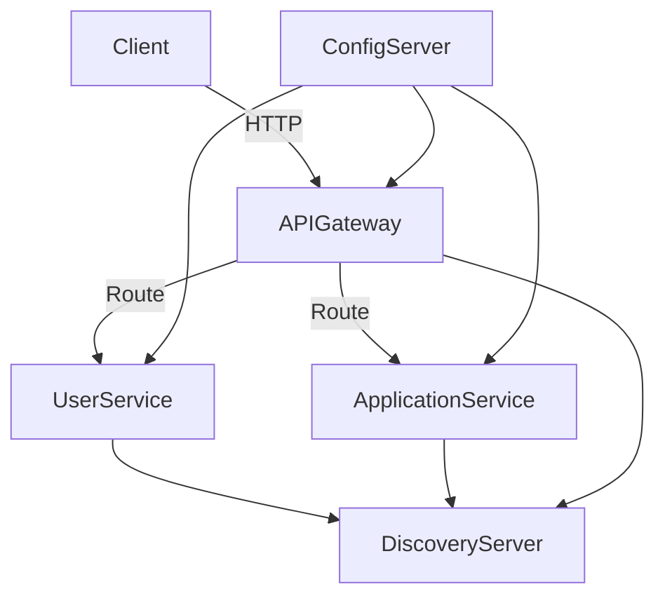

# 🧩 Job Application System - Microservices Architecture

This is a Job Application System built using Spring Boot and Microservices Architecture. Each service is modular and registered via Eureka Discovery Server with centralized configuration.

---

##   Microservices Structure

| Service             | Description                                | Port |
|--------------------|--------------------------------------------|------|
| config-server       | Centralized configuration via GitHub repo | 8888 |
| discovery-server    | Eureka service registry                   | 8761 |
| user-service        | Manages job seekers and HR users          | 8082 |
| application-service | Handles job applications & statuses       | 8081 |
| api-gateway         | Routes and protects APIs                  | 8083 |

---

##   Architecture Overview



>   All services retrieve their configuration from ConfigServer, which pulls from a GitHub repository.

---

##   How to Run the Project

```bash
git clone https://github.com/mohanad-abdalwahab/job-application-system.git
cd job-application-system
```

1. Build the project using Maven or IntelliJ.
2. Start services in order:
   - `config-server` → provides centralized configuration
   - `discovery-server` → registers all services (Eureka)
   - `user-service` → manages users (job seekers, HR)
   - `application-service` → handles job applications
   - `api-gateway` → routes requests to appropriate service

3. Access endpoints:
   - Eureka dashboard: http://localhost:8761
   - API Gateway: http://localhost:8083

---

##   Technologies Used

- Java 17  
- Spring Boot 3.x  
- Spring Cloud (Config, Eureka, Gateway)  
- Maven  
- IntelliJ IDEA / PyCharm  
- Git + GitHub  

---

##   Author

**Mohanad Abdalwahab**  
Master's student in Information Technology, Islamic University of Gaza  
Advanced Software Engineering course, supervised by Dr. Abdul Karim Al-Ashqar

---

## 📄 License

This project is licensed under the MIT License – see the LICENSE file for details.
